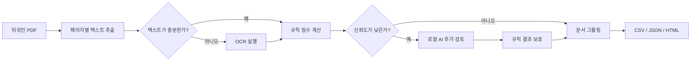

# Loan Package Review

여러 종류의 대출 서류가 뒤섞인 PDF를 페이지별로 분류하고, 같은 문서에 속한 페이지를
논리적으로 묶어주는 프로그램입니다.

이 프로그램은 대출 승인 여부를 결정하지 않습니다. 향후 AUS(Automated Underwriting
System)가 소득·신용·담보 정보를 추출하기 전에 문서를 정리하는 전처리 단계입니다.

- [package_02 분류 결과 보기](https://baegjonghyeon291-lab.github.io/loan-package-review/)
- [PRD](docs/PRD.md)
- [기술 설계](docs/TECHNICAL_DESIGN.md)
- [데이터 구조](docs/DATA_SCHEMA.md)
- [ERD](docs/ERD.md)
- [실험 및 오답 분석](docs/EXPERIMENTS.md)

## 1. 주요 기능

- PDF를 페이지 단위로 읽고 원본 페이지 번호 유지
- 텍스트가 포함된 페이지는 PDF에서 직접 추출
- 텍스트가 없는 이미지 페이지만 선택적으로 OCR 실행
- 규칙과 로컬 AI를 함께 사용해 페이지 유형 분류
- 분류 신뢰도, 판정 근거, 처리 방식 기록
- 같은 문서에 속한 페이지 그룹핑 및 문서 내부 순서 추정
- 결과를 CSV, JSON, HTML로 저장
- package_01 정답 자동 생성 및 정확도 평가
- 브라우저에서 새 PDF 업로드·분석·결과 확인

## 2. 분류 유형

| 유형 | 설명 | 예시 |
|---|---|---|
| `URLA_1003` | 대출 신청서 | Uniform Residential Loan Application, Form 1003 |
| `INCOME_DOC` | 소득 증빙 | Paystub, W-2, 1040, 1099, VOE, P&L |
| `CREDIT_REPORT` | 신용 보고서 | Tri-merge Credit Report, Credit Score Disclosure |
| `TITLE_REPORT` | 권원 보고서 | Title Commitment, Preliminary Title Report |
| `OTHER` | 위 유형에 해당하지 않거나 근거가 부족한 페이지 | 검토가 필요한 기타 문서 |

## 3. 처리 흐름



AI는 모든 페이지를 판단하지 않습니다. 명확한 페이지는 빠르고 재현 가능한 규칙으로 처리하고,
판단이 애매한 페이지만 로컬 AI가 추가로 검토합니다. AI가 기존 근거와 충돌하면 지원 유형을
함부로 덮어쓰지 않고 사람의 검토 대상으로 남깁니다.

## 4. 기술 선택과 이유

| 기술 | 선택 이유 | 한계 |
|---|---|---|
| `pypdf` | 페이지 경계를 유지하면서 내장 텍스트를 빠르게 추출 | 이미지 페이지는 읽지 못함 |
| Poppler + Tesseract | 텍스트가 없는 페이지만 렌더링하고 OCR 처리 | 스캔 화질과 회전에 영향을 받음 |
| 가중치 기반 규칙 | 빠르고 결정적이며 판정 근거를 설명하기 쉬움 | 새로운 양식이 추가되면 규칙 보완 필요 |
| Ollama + `qwen2.5:3b` | 데이터를 외부로 보내지 않고 애매한 페이지만 검토 | 규칙보다 느리고 `OTHER`를 과하게 예측할 수 있음 |
| CSV / JSON / HTML | 데이터베이스 없이도 결과 확인과 재현이 쉬움 | 다중 사용자 서비스 기능은 제공하지 않음 |

### 선택하지 않은 방법

- **Kordoc 중심 처리:** 파일 전체 본문 추출에는 편리하지만 페이지 경계와 페이지 이미지 처리가
  핵심인 이번 과제에는 적합하지 않아 주 파서로 선택하지 않았습니다.
- **LLM 단독 분류:** 초기 실험에서 AI가 규칙 결과를 자유롭게 변경하게 했더니 package_01
  정확도가 100%에서 76.92%로 떨어졌습니다.
- **모델 파인튜닝:** 제공된 데이터가 작고 `OTHER` 정답 사례가 없어 일반화 성능을 입증하기
  어렵다고 판단했습니다.
- **전체 페이지 OCR:** 83페이지 중 80페이지는 내장 텍스트를 바로 읽을 수 있어 불필요한 시간과
  오류가 늘어납니다.

## 5. 프로젝트 구조

```text
loan-package-review/
|-- src/loan_document_classifier/
|   |-- extraction.py       PDF 텍스트 추출 및 OCR
|   |-- classification.py   규칙 기반 페이지 분류
|   |-- ai.py               로컬 AI 추가 검토
|   |-- grouping.py         문서 그룹핑과 순서 추정
|   |-- evaluation.py       정확도 및 유형별 지표
|   |-- ground_truth.py     package_01 정답 생성
|   |-- report.py           HTML 결과 생성
|   `-- webapp.py           로컬 PDF 업로드 서버
|-- tests/                  자동 테스트
|-- docs/                   PRD, ERD, 설계 및 실험 문서
|-- submission/             제출용 결과 파일
|-- scripts/                검증 및 로컬 뷰어 스크립트
`-- README.md
```

## 6. 설치 방법

### 요구 환경

- Python 3.11 이상
- Poppler
- Tesseract OCR
- Ollama (로컬 AI를 사용할 경우)

### Python 환경 설치

```powershell
python -m venv .venv
.venv\Scripts\Activate.ps1
python -m pip install -e ".[dev]"
```

브라우저 UI와 선택 기능까지 설치하려면 다음 명령을 사용합니다.

```powershell
python -m pip install -e ".[all]"
```

### Windows 도구 설치

```powershell
winget install --id oschwartz10612.Poppler -e
winget install --id UB-Mannheim.TesseractOCR -e
winget install --id Ollama.Ollama -e
ollama pull qwen2.5:3b
```

## 7. 데이터 배치

과제 PDF는 외부 공유가 금지되어 있으므로 Git에 커밋하지 않습니다.

```text
data/input/
|-- package_01/
|   |-- package_01_shuffled.pdf
|   |-- URLA_1003.pdf
|   |-- INCOME_DOC.pdf
|   |-- CREDIT_REPORT.pdf
|   `-- TITLE_REPORT.pdf
`-- package_02_shuffled.pdf
```

`data/input/`과 `outputs/`는 `.gitignore`에 포함되어 있습니다.

## 8. 브라우저에서 PDF 분석하기

로컬 업로드 서버를 실행합니다.

```powershell
python -m loan_document_classifier.webapp --host 127.0.0.1 --port 8765
```

브라우저에서 다음 주소를 엽니다.

```text
http://127.0.0.1:8765
```

사용 순서:

1. PDF 파일 선택
2. OCR과 추가 검토 사용 여부 선택
3. `분석 시작` 클릭
4. 페이지 이미지, 분류 결과, 신뢰도, 판정 근거 확인
5. 필요하면 다른 PDF 분석 또는 현재 결과 삭제

업로드한 원본 PDF는 결과 생성 후 자동으로 삭제됩니다. 세션 결과는 Git에서 제외된
`outputs/runtime/`에만 저장되며 결과 화면에서 삭제할 수 있습니다.

## 9. 명령줄 사용법

### package_01 Ground Truth 생성

```powershell
python -m loan_document_classifier.cli build-ground-truth data/input/package_01 `
  --output outputs/package_01/ground_truth.csv
```

### 규칙 기반 분석

```powershell
python -m loan_document_classifier.cli analyze `
  data/input/package_01/package_01_shuffled.pdf `
  --output outputs/package_01
```

### OCR과 로컬 AI를 포함한 분석

```powershell
python -m loan_document_classifier.cli analyze `
  data/input/package_02_shuffled.pdf `
  --output outputs/package_02 `
  --ocr `
  --ai-model qwen2.5:3b `
  --ai-provider ollama
```

### package_01 정확도 평가

```powershell
python -m loan_document_classifier.cli evaluate `
  outputs/package_01/results.json `
  outputs/package_01/ground_truth.csv `
  --output outputs/package_01/metrics.json
```

### 전체 제출 검증

```powershell
powershell -ExecutionPolicy Bypass -File scripts/verify.ps1
```

검증 스크립트는 테스트, Python 컴파일, Git PDF 추적 여부, 제출 결과의 PII 포함 여부를
한 번에 확인합니다.

## 10. 정확도 측정

### Ground Truth 생성 방법

1. package_01의 각 페이지에서 텍스트 추출
2. 공백과 대소문자를 정규화
3. 페이지 텍스트의 SHA-256 지문 생성
4. 분리된 정답 PDF 4종의 페이지 지문과 매칭
5. 정확히 하나의 원본 페이지와 일치할 때만 정답 라벨 생성

그다음 각 원본 PDF 페이지 위치의 예측값과 정답을 비교해 다음 지표를 계산합니다.

- 전체 정확도
- 유형별 precision, recall, F1
- confusion matrix
- 오분류 페이지 목록

### package_01 결과

| 유형 | 정답 페이지 | 정확히 분류한 페이지 |
|---|---:|---:|
| `URLA_1003` | 11 | 11 |
| `INCOME_DOC` | 1 | 1 |
| `CREDIT_REPORT` | 18 | 18 |
| `TITLE_REPORT` | 9 | 9 |
| 합계 | 39 | 39 |

현재 제공 양식 기준 페이지 정확도는 **39/39, 100%**입니다.

이 수치는 제공된 데이터를 확인하고 규칙을 보완한 in-sample 결과입니다. 새로운 금융회사 양식이나
낮은 화질의 스캔에서도 100%를 보장한다는 의미는 아닙니다.

### 초기 오분류 사례

초기 규칙은 37/39, 94.87%였습니다.

1. 내용이 익명화 문구로 대체된 Title Report의 plat map
2. 문서 제목 없이 금액과 세무 작성자 번호만 남은 1페이지 P&L

두 페이지의 실패 원인을 분석해 익명화된 plat map 표시와 세무 작성자 식별자를 증거 규칙에
추가했습니다. 자세한 과정은 [실험 및 오답 분석](docs/EXPERIMENTS.md)에 기록했습니다.

## 11. package_02 결과

| 유형 | 페이지 수 |
|---|---:|
| `URLA_1003` | 10 |
| `INCOME_DOC` | 5 |
| `CREDIT_REPORT` | 15 |
| `TITLE_REPORT` | 14 |
| `OTHER` | 0 |
| 합계 | 44 |

텍스트가 없던 3페이지는 Poppler로 렌더링한 뒤 Tesseract OCR을 적용해 모두
`TITLE_REPORT`로 분류했습니다. 신뢰도가 낮은 소득 문서 2페이지만 로컬 AI가 추가 검토했습니다.

제출 결과:

- `submission/package_02_pages.csv`
- `submission/package_02_results.json`
- `submission/package_02_report.html`

## 12. 문서 그룹핑에 대한 가정

과제 설명은 연속된 페이지를 하나의 문서로 묶도록 요구하지만, 제공된 PDF는 페이지 전체가
무작위로 섞여 있습니다. 따라서 단순히 현재 PDF에서 연속된 같은 유형을 합치지 않았습니다.

결과에는 다음 값을 구분해 저장합니다.

- `source_page`: 섞인 PDF에서 현재 페이지 위치
- `document_page`: 문서 내부에서 추정한 페이지 번호
- `document_id`: 같은 문서로 판단한 그룹
- `is_start`, `is_end`: 문서의 시작·끝 페이지 여부

`Page N of M`, 양식 페이지 번호, 문서 유형 등의 증거로 순서를 추정합니다. 총 페이지 수가
명시되지 않으면 문서가 완전하다고 단정하지 않습니다.

## 13. 보안 처리

- 과제 원본 PDF를 Git에서 제외
- 외부 AI 기본 비활성화
- 제공 데이터 분석에는 로컬 Ollama 사용
- AI 전달 전 SSN, 이메일, 전화번호 형태 마스킹
- 공개 결과에 추출 원문과 페이지 이미지 제외
- 로컬 업로드 파일은 분석 후 자동 삭제
- 로컬 결과는 `127.0.0.1`에서만 제공

## 14. 현재 한계와 개선 방향

- package_01은 유형별 원본 문서가 하나씩만 제공됨
- package_01에 `OTHER` 정답 사례가 없어 해당 유형의 성능을 측정할 수 없음
- 처음 보는 금융회사·양식·언어에 대한 별도 검증이 필요함
- 손글씨, 낮은 화질, 잘린 스캔은 OCR 정확도가 낮을 수 있음
- 같은 유형의 문서가 여러 개일 때 안정적인 report ID가 없으면 완전한 분리가 어려움
- 문서 그룹핑 신뢰도를 평가할 별도의 정답 데이터가 없음
- 실제 서비스에서는 암호화 저장소, 접근 권한, 보존 기간, 감사 로그가 필요함

다음 단계는 더 다양한 대출 패키지로 holdout 평가를 수행하고, 문서별 필드 추출 결과를 AUS의
규칙 엔진과 연결하는 것입니다.
