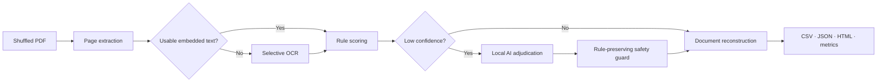

# Loan Package Review

A page classification and document grouping tool for shuffled mortgage-loan PDF packages. It
prepares documents for later field extraction and underwriting workflows; it does not make lending
decisions.

**[Open the package 02 sample results](https://baegjonghyeon291-lab.github.io/loan-package-review/)**

## Why this submission is different

- Every result includes confidence, evidence, extraction method, and review status.
- Embedded PDF text is preferred; OCR is used only for image-only pages.
- Deterministic rules handle obvious forms, while ambiguous pages can be sent to an opt-in AI
  adjudicator through an OpenAI-compatible interface, including a local endpoint.
- Package 01 ground truth is reconstructed automatically from the separated originals.
- Shuffled source position and logical document position are modeled separately.
- Restricted input PDFs and generated outputs are excluded from Git.

## Supported document types

- `URLA_1003`: Uniform Residential Loan Application / Form 1003
- `INCOME_DOC`: paystubs, tax forms/transcripts, P&L, W-2, 1099, VOE
- `CREDIT_REPORT`: credit and employment verification reports
- `TITLE_REPORT`: title commitments, preliminary reports, chain-of-title reports
- `OTHER`: unsupported or insufficient-evidence pages

## Architecture



See [PRD](docs/PRD.md), [technical design](docs/TECHNICAL_DESIGN.md), and
[data schema](docs/DATA_SCHEMA.md). A production-oriented [ERD](docs/ERD.md) is included as an
extension design; the coding-test runtime itself remains database-free.

For a concise reviewer walkthrough, use the [five-minute demo script](docs/DEMO_SCRIPT.md).

Run the final repository, test, and PII checks with:

```powershell
powershell -ExecutionPolicy Bypass -File scripts/verify.ps1
```

## Technology choices and trade-offs

| Choice | Why it is used | Main trade-off |
|---|---|---|
| `pypdf` | Preserves source-page boundaries and extracts embedded text cheaply | Does not OCR image-only pages |
| Poppler + Tesseract | Renders and reads only pages without usable embedded text | Adds local binaries and scan-quality variance |
| Weighted document rules | Fast, deterministic, and records the evidence behind a label | Template changes require rule maintenance |
| Local Ollama (`qwen2.5:3b`) | Reviews ambiguous pages without sending restricted data externally | Slower than rules and can over-predict `OTHER` |
| CSV, JSON, and HTML | Results are inspectable without a database or proprietary viewer | Not a multi-user production service |

Whole-document parsers such as Kordoc were considered but not selected as the primary parser
because this task must preserve page boundaries and render individual pages. An LLM-only design was
rejected after a permissive local-AI experiment reduced package 01 accuracy to 76.92%. Fine-tuning
was also rejected because the supplied labels contain too little template and `OTHER` diversity to
support a credible generalization claim.

## Setup

Python 3.11 or later is required.

```bash
python -m venv .venv
.venv/Scripts/activate
python -m pip install -e ".[dev]"
```

For OCR and the review UI:

```bash
python -m pip install -e ".[all]"
```

Poppler (`pdftoppm`) and Tesseract must also be installed and available on `PATH` when `--ocr`
is used. OCR runs in isolated subprocesses so a native OCR failure cannot terminate the parser.

## Data placement

Do not commit the coding-test archive. Place files as follows:

```text
data/input/
├── package_01/
│   ├── package_01_shuffled.pdf
│   ├── URLA_1003.pdf
│   ├── INCOME_DOC.pdf
│   ├── CREDIT_REPORT.pdf
│   └── TITLE_REPORT.pdf
└── package_02_shuffled.pdf
```

## Commands

Build reproducible package 01 ground truth:

```bash
loan-doc build-ground-truth data/input/package_01 --output outputs/package_01/ground_truth.csv
```

Run the deterministic local pipeline:

```bash
loan-doc analyze data/input/package_01/package_01_shuffled.pdf --output outputs/package_01
```

Enable OCR fallback:

```bash
loan-doc analyze data/input/package_02_shuffled.pdf --output outputs/package_02 --ocr
```

Use an opt-in AI reviewer only for low-confidence pages:

```bash
loan-doc analyze data/input/package_02_shuffled.pdf --output outputs/package_02 \
  --ocr --ai-model YOUR_MODEL
```

For local Ollama, use `--ai-model qwen2.5:3b --ai-provider ollama`. The Ollama adapter uses only
the Python standard library and sends evidence to `http://localhost:11434` by default.
External AI use should be confirmed with the data owner before transmitting document evidence.

Windows local-tool setup used for the verified run:

```powershell
winget install --id oschwartz10612.Poppler -e
winget install --id UB-Mannheim.TesseractOCR -e
winget install --id Ollama.Ollama -e
ollama pull qwen2.5:3b
```

Evaluate package 01:

```bash
loan-doc evaluate outputs/package_01/results.json outputs/package_01/ground_truth.csv \
  --output outputs/package_01/metrics.json
```

Launch the review UI:

```bash
streamlit run app.py
```

Every `analyze` command also creates a dependency-free `report.html`. This is the reliable review
fallback for locked-down environments where native Streamlit dependencies are unavailable.
Open `submission/package_02_report.html` directly in a browser to review the supplied result.

### Local document review

The public report intentionally excludes page images and extracted text. To inspect the supplied
PDF locally with real page renders and text, run `scripts/build_local_review.py`, then serve its
ignored output directory on `127.0.0.1`. The generated viewer contains restricted data and must
never be committed or published.

### Browser upload application

Run the local upload server to analyze a new PDF from the browser:

```powershell
python -m loan_document_classifier.webapp --host 127.0.0.1 --port 8765
```

Open `http://127.0.0.1:8765`, select a PDF, choose OCR/local AI, and start analysis. The upload is
deleted after report generation. Session results remain only under ignored `outputs/runtime/` and
can be deleted from the result screen.

## Measured package 01 baseline

The current deterministic pipeline classifies 39 of 39 supplied package 01 pages correctly
(100% page accuracy): 11 URLA, 1 income, 18 credit, and 9 title pages. This is an in-sample,
template-specific result, not a claim of production generalization. The forms contain repeated,
highly distinctive headers, and two sparse edge cases were analyzed explicitly.

Ground truth is generated in code by normalizing each shuffled page's extracted text, hashing it,
and matching that fingerprint to exactly one page in the four separated reference PDFs. Evaluation
then compares the predicted and matched label for every source page and reports accuracy,
per-class precision, recall, F1, confusion-matrix counts, and the error list.

The initial baseline scored 37/39 (94.87%). Its two errors were:

1. An anonymized plat-map page with all substantive content removed.
2. A one-page P&L containing amounts and a tax-preparer identifier but no document title.

The final rules capture those general evidence types while keeping the pages reviewable. A proper
production assessment requires unseen lenders, issuers, scans, rotations, and OCR degradation.

The verified local hybrid used `qwen2.5:3b` through Ollama. Package 01 retained 100% accuracy with
one AI review. Package 02 invoked AI for two low-confidence income pages; one agreement raised
confidence, while one disagreement preserved the rule result and remained flagged for review.

## Important assumptions

The prompt describes contiguous document grouping, but the supplied package pages are globally
shuffled. The implementation therefore distinguishes `source_page` from `document_page` and uses
internal page markers for reconstruction. The supplied archive contains two shuffled packages,
despite the prompt mentioning three packages.

## Current limitations and next steps

- The small reference set contains only one document per supported type.
- Document identity grouping must add borrower-independent report IDs for multi-document packages.
- OCR quality depends on the local Tesseract installation and scan quality.
- AI calibration needs a larger held-out dataset and cost/latency measurement.
- `OTHER` has no labeled examples in package 01, so its precision cannot be measured there.
- Ground-truth comparison is available for package 01 metrics but is not shown beside every page.
- Production use needs encrypted storage, retention controls, PII-aware observability, and access
  auditing.
