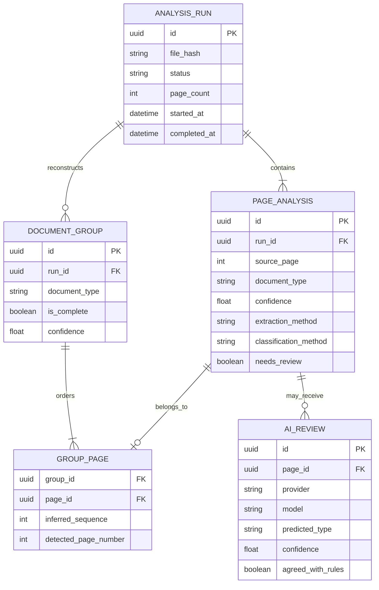

# Persistence ERD

The coding-test implementation deliberately persists transparent CSV and JSON artifacts instead
of requiring a database. A production service can use the following model without changing the
external result schema.

Raw page text is intentionally absent from the default persistence model. If production debugging
requires it, it should be encrypted separately with strict retention and access controls.

